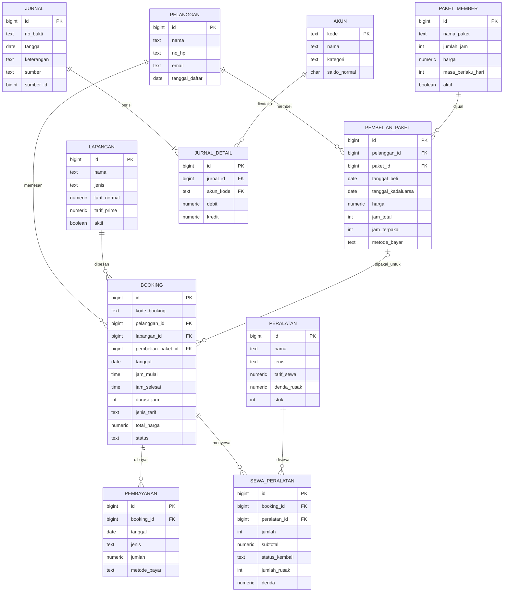

# Sistem Akuntansi Pendapatan Sewa Lapangan Padel pada Smash Padel Club

Tugas UTS mata kuliah **Pengkodean dan Pemrograman** – S1 Akuntansi.

🌐 **Demo website:** https://zayyanberyl-coding.github.io/sistem-akuntansi-padel/

Web app satu halaman (single-page) untuk mencatat booking lapangan padel, pembayaran,
sewa peralatan, dan penjualan paket member. Setiap transaksi **otomatis dijurnal**
oleh trigger database, lalu diringkas menjadi Jurnal Umum, Buku Besar, dan Laporan Pendapatan.

## Teknologi

| Bagian   | Teknologi |
|----------|-----------|
| Frontend | HTML, CSS, JavaScript murni (tanpa framework), satu `index.html` dengan sidebar |
| Backend  | [Supabase](https://supabase.com) (PostgreSQL) + trigger PL/pgSQL |
| Koneksi  | `supabase-js` v2 via CDN, memakai **anon key** saja |
| Tampilan | Font [Inter](https://fonts.google.com/specimen/Inter), ikon [Tabler Icons](https://tabler.io/icons), foto dari [Unsplash](https://unsplash.com/s/photos/padel-court) (lisensi gratis) |

## Fitur

| Menu | Isi |
|------|-----|
| **Dashboard** | Booking hari ini, pendapatan bulan ini, saldo kas, saldo pendapatan diterima di muka, jadwal hari ini, stok peralatan |
| **Booking** | Form booking, pratinjau tarif normal/prime time, **cek bentrok jadwal**, grid jadwal lapangan, tandai selesai/batal |
| **Pembayaran** | Terima DP / pelunasan, status booking otomatis jadi `dp` / `lunas` |
| **Peralatan** | Kelola raket & bola, sewa peralatan (stok otomatis berkurang), pengembalian (stok bertambah) dan denda kerusakan |
| **Member** | Data pelanggan, jenis paket member, penjualan paket (sisa jam & masa berlaku) |
| **Jurnal Umum** | Jurnal otomatis per periode + cek keseimbangan debit/kredit |
| **Buku Besar** | Mutasi per akun dengan saldo awal dan saldo berjalan |
| **Laporan Pendapatan** | Pendapatan per akun, rincian per lapangan, siap cetak |

### Aturan tarif
- Jam operasional 07.00–23.00, booking per jam penuh.
- **Normal**: Senin–Jumat 07.00–17.00.
- **Prime time**: Senin–Jumat 17.00–23.00, serta Sabtu–Minggu seharian.
- Tarif dihitung per jam, jadi booking 16.00–18.00 di hari kerja = 1 jam normal + 1 jam prime.

## Logika Akuntansi (jurnal otomatis via trigger)

| Transaksi | Debit | Kredit | Trigger |
|-----------|-------|--------|---------|
| Terima DP / pelunasan booking | Kas | Pendapatan Diterima di Muka | `pembayaran_sesudah_insert` |
| Booking selesai dimainkan | Pendapatan Diterima di Muka | Pendapatan Sewa Lapangan | `booking_sesudah_update` |
| Booking batal, DP hangus | Pendapatan Diterima di Muka | Pendapatan Lain-lain | `booking_sesudah_update` |
| Beli paket member | Kas | Pendapatan Diterima di Muka | `pembelian_paket_sesudah_insert` |
| Main pakai paket (diakui per jam) | Pendapatan Diterima di Muka | Pendapatan Sewa Lapangan | `booking_sesudah_update` |
| Sewa peralatan | Kas | Pendapatan Sewa Peralatan | `sewa_sesudah_insert` |
| Denda kerusakan peralatan | Kas | Pendapatan Denda | `sewa_sesudah_update` |

**Mengapa DP dicatat sebagai Pendapatan Diterima di Muka?** Uang sudah diterima,
tetapi jasanya (lapangan) belum diberikan. Sesuai prinsip akrual/PSAK 72,
uang itu masih berupa **kewajiban** dan baru diakui sebagai pendapatan saat
lapangan selesai dipakai.

### Bagan akun

| Kode | Nama | Kategori | Saldo normal |
|------|------|----------|--------------|
| 1-101 | Kas | Aset | Debit |
| 2-101 | Pendapatan Diterima di Muka | Kewajiban | Kredit |
| 4-101 | Pendapatan Sewa Lapangan | Pendapatan | Kredit |
| 4-102 | Pendapatan Sewa Peralatan | Pendapatan | Kredit |
| 4-103 | Pendapatan Denda | Pendapatan | Kredit |
| 4-201 | Pendapatan Lain-lain | Pendapatan | Kredit |

### Alur status booking

```
menunggu ──bayar DP──▶ dp ──pelunasan──▶ lunas ──dimainkan──▶ selesai
    │                  │                   │
    └──────────────────┴───────────────────┴──────▶ batal (DP hangus)
```
Booking dengan paket member langsung berstatus `lunas` dan jam paketnya dipotong.
Jika dibatalkan, jam paket dikembalikan.

## ERD



## Struktur Folder

```
sistem-akuntansi-padel/
├── backend/
│   ├── schema.sql      # 11 tabel, relasi, view, keamanan (RLS)
│   ├── triggers.sql    # fungsi tarif, cek bentrok, stok, jurnal otomatis
│   ├── seed.sql        # data contoh (sedikit)
│   └── seed_tambahan.sql  # data contoh 1,5 bulan (opsional)
├── frontend/
│   ├── index.html      # satu halaman + sidebar
│   ├── css/style.css
│   ├── img/logo.svg    # logo Smash Padel Club (juga dipakai sebagai favicon)
│   └── js/
│       ├── supabase.js    # koneksi (URL + anon key)
│       ├── app.js         # fungsi bantu + pindah menu
│       ├── animasi.js     # animasi & efek interaksi (count-up, skeleton, dll.)
│       ├── dashboard.js
│       ├── booking.js
│       ├── pembayaran.js
│       ├── peralatan.js
│       ├── member.js
│       ├── jurnal.js
│       ├── bukubesar.js
│       └── laporan.js
├── index.html          # pengalih ke frontend/ (untuk GitHub Pages)
├── .gitignore
└── README.md
```

## Cara Menjalankan

### 1. Siapkan database di Supabase
1. Buat akun & project baru di [supabase.com](https://supabase.com).
2. Buka **SQL Editor** → **New query**.
3. Salin isi `backend/schema.sql` → **Run**.
4. Salin isi `backend/triggers.sql` → **Run**.
5. Salin isi `backend/seed.sql` → **Run**. Hasil terakhir harus menunjukkan
   `total_debit` = `total_kredit` (nominalnya bisa berbeda tergantung hari
   dijalankan, karena tanggal contoh dihitung dari hari ini dan tarif akhir pekan berbeda).
6. *(Opsional)* Salin isi `backend/seed_tambahan.sql` → **Run**, cukup sekali.
   Menambah ±25 pelanggan dan ±700 booking selama 45 hari terakhir s.d. 10 hari
   ke depan (prime time & akhir pekan lebih ramai), lengkap dengan pembayaran,
   pembatalan, dan sewa peralatan, supaya dashboard & laporan terlihat realistis.

> `schema.sql` menghapus tabel lama sebelum membuat ulang. Jangan dijalankan
> ulang jika datamu sudah penting.

### 2. Hubungkan frontend
1. Di Supabase buka **Project Settings → API**.
2. Salin **Project URL** dan **anon / publishable key**.
3. Tempel ke `frontend/js/supabase.js`:
   ```js
   const SUPABASE_URL = 'https://abcdxyz.supabase.co';
   const SUPABASE_ANON_KEY = 'eyJhbGciOi...';
   ```

> ⚠ **Jangan pernah** memakai `service_role` / `secret` key di frontend. Key itu
> melewati semua aturan keamanan. Aplikasi ini akan menolak berjalan jika key
> tersebut terdeteksi.

### 3. Jalankan
- Cara termudah: di VS Code pasang ekstensi **Live Server**, klik kanan
  `frontend/index.html` → **Open with Live Server**.
- Atau cukup klik dua kali `frontend/index.html` untuk membukanya di browser.

## Keamanan
- Aplikasi hanya memakai **anon key**; keamanan dijaga oleh **Row Level Security**.
- Tabel `jurnal` dan `jurnal_detail` hanya bisa **dibaca** dari aplikasi. Isinya
  dibuat oleh trigger (`security definer`), sehingga jurnal tidak bisa dipalsukan.
- Tidak ada izin `DELETE`. Transaksi dibatalkan lewat status, sehingga jejak audit tetap ada.
- Harga, status, stok, dan bentrok jadwal divalidasi ulang di database, bukan hanya di browser.

## Keterbatasan
- Belum ada login. Siapa pun yang memegang anon key bisa menambah data (cukup untuk tugas kuliah).
  Untuk produksi, tambahkan Supabase Auth dan batasi policy ke role `authenticated`.
- Sisa jam paket member yang kadaluarsa masih tercatat di Pendapatan Diterima di Muka.
  Idealnya diakui sebagai pendapatan (breakage) lewat jurnal penyesuaian.
- Pembelian stok peralatan baru tidak dijurnal (sistem fokus pada siklus pendapatan).
- Supabase membatasi 1.000 baris per query. Cukup untuk demo, tetapi untuk data besar
  ringkasan sebaiknya dihitung dengan view/fungsi SQL.
